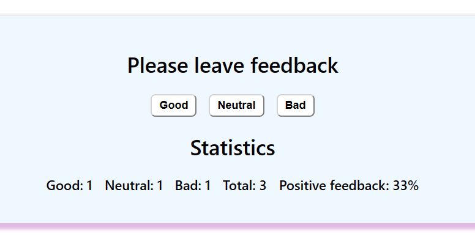

# Feedback

Do you need to share what you think? Do you want to leave some feedback on a
matter? Then this simple feedback app is for U! Just try it out!

## Demo

Check it out: https://weronikakingrzegorek.github.io/goit-react-hw-04-feedback/

## Preview

## Description

Do You think this is good? Then click good. Or maybe it is bad? Then click bad!
The app will count total votes and the positive percentage, so You can follow
the stats!

## Created with

React, JS, HTML, CSS.

## Setup

Clone this repo to your desktop and run npm install to install all the
dependencies.

Next run npm start to start the app.

Finally, acces it at localhost:3000.
